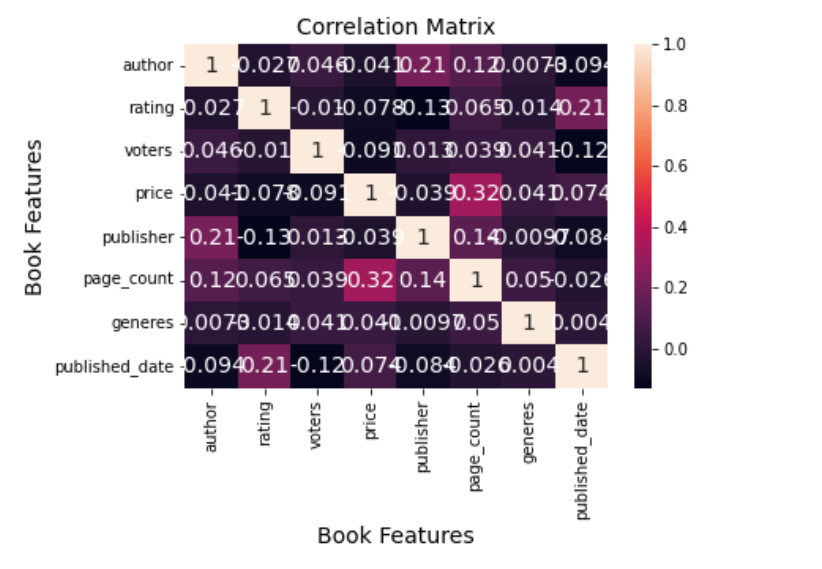
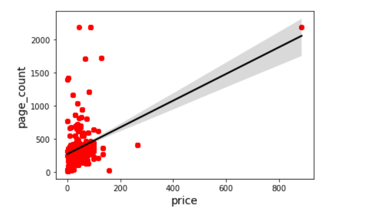

# book_data_python
Goal: Train machine learning model based on google books dataset for learning purposes and fun over winter break 2023.

Work in progress.

Data visualization complete. 

Further Info: Reference jupyter notebook, all visuals are in there, feel free to reach out to my email at crcarta@my.ccsu.edu for any clarification. Aware readme is undetailed, I am writing a more detailed overview of the project in LaTeX.

